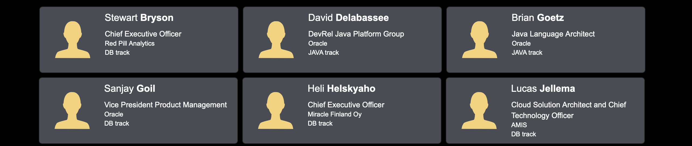

# Lab 10: jlink ⛔

## Overview

In this lab, you will use *`jlink`*, a tool that can assemble and optimize a set of modules and their dependencies to create a custom, i.e. optimized, run-time Java image. `jlink` is part of the JDK since JDK 9.

...

## Using `jlink` with Helidon applications 

`mvn package -Pjlink-image -Djlink.image.defaultJvmOptions="--enable-preview"`

To run the application with its custom Java runtime image.
`target/conference-app/bin/start`

* [JEP 282: `jlink`](https://openjdk.java.net/jeps/282)
* [The jlink Command](https://docs.oracle.com/en/java/javase/14/docs/specs/man/jlink.html)
* [Helidon SE — Custom Runtime Images with `jlink`](https://helidon.io/docs/v2/#/se/guides/37_jlink_image)
* [Helidon Maven Plugin](https://github.com/oracle/helidon-build-tools/tree/master/helidon-maven-plugin#goal-jlink-image)

## Wrap-up

 

