# Lab 2: Setup your Oracle Cloud environment

## Overview


In this 10-minutes lab, you will prepare your Oracle Cloud environment to run the rest of the lab.

 
## Create a Virtual Cloud Network

In this step, you will create a *Virtual Cloud Network (VCN)*, i.e. a software-defined private network in the Oracle Cloud Infrastructure. See [here](https://docs.cloud.oracle.com/en-us/iaas/Content/Network/Tasks/managingVCNs.htm) for more details on VCN.


1. Log on the OCI console, select **Networking** in **Core Infrastructure** (top-left hamburger button), then **Virtual Cloud Networks**.

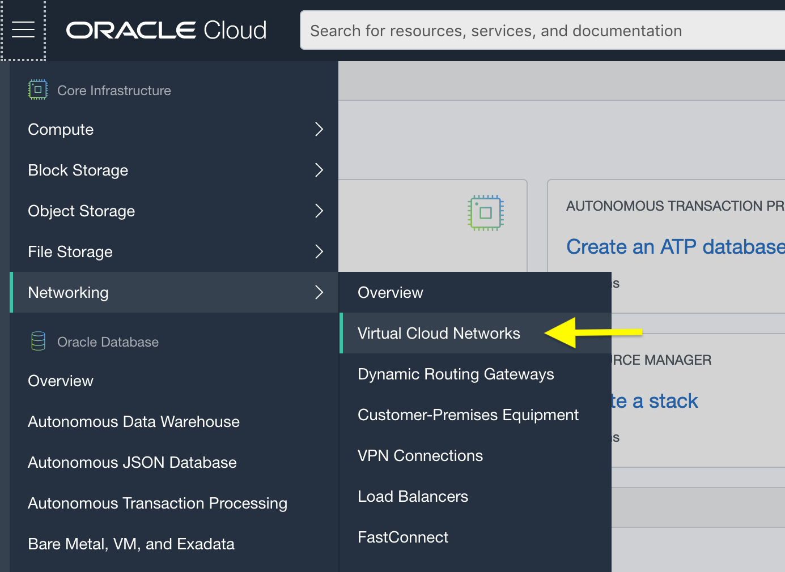

2. Make sure your **root** compartment is selected.

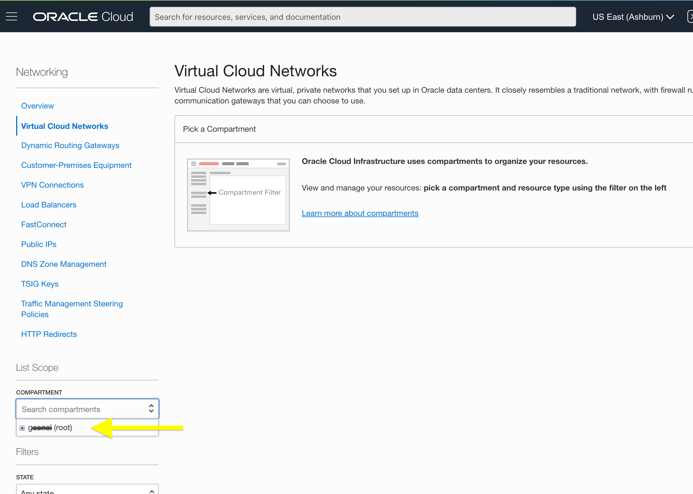

3. You will now create a Virtual Cloud Network using the VCN Wizard, click **Start VCN Wizard**.

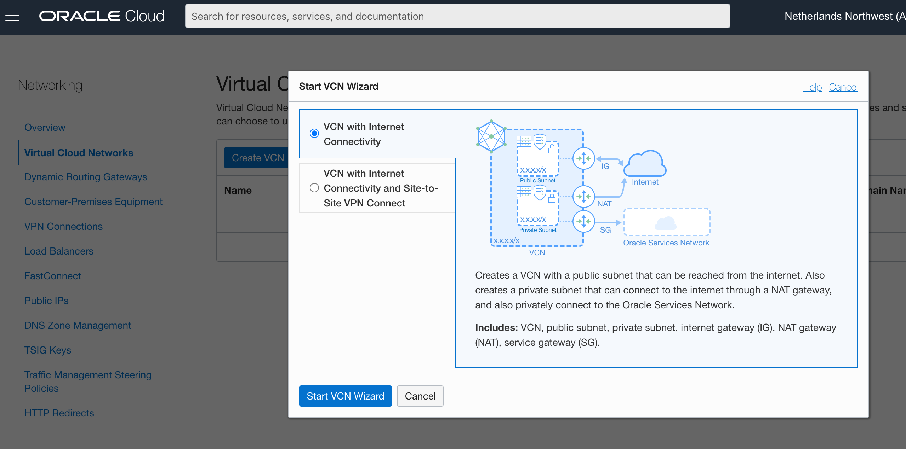

4. Select **VCN with Internet Connectivity** ➡ **Start VCN Wizard**.

5. Give it a meaningful name, ex. "HOL_VCN", and keep other default values.

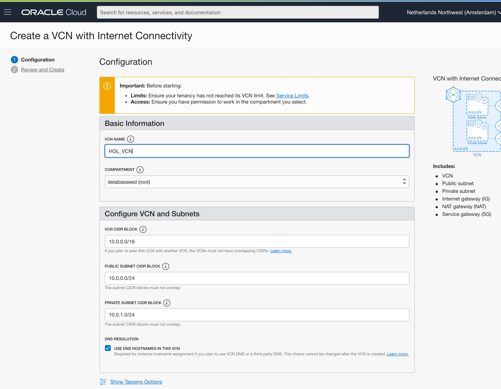

6. Clicking **Next** will display a summary of the VCN configuration. Review it and click **Create** to actually create the VCN.

After a couple of seconds, your VCN will be created (including a public and a private subnet, routing tables, an internet gateway, etc.).

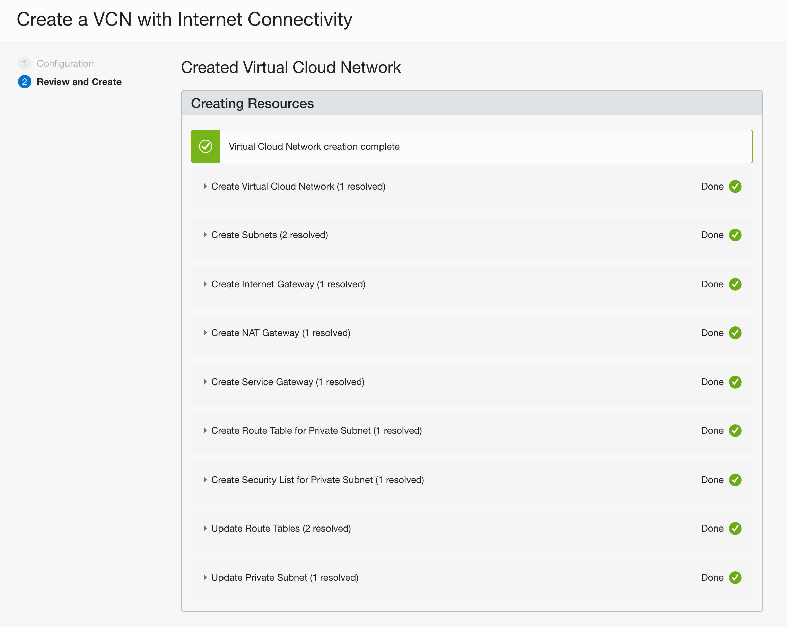

You still need to do one thing, i.e. configure a security rule to allow requests coming from the Internet to reach your Java application(s) running on OCI. For this, you will define an *Ingress Rule* on the VCN public subnet (not the private one!). to open port 8080.

1. From the top left hamburger menu, select **Core Infrastructure** ➡ **Networking** ➡ **Virtual Cloud Networks**, and click on your newly created VCN to see its details.

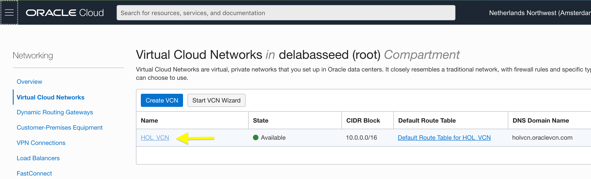

2. Click on the public subnet (not the private one!)

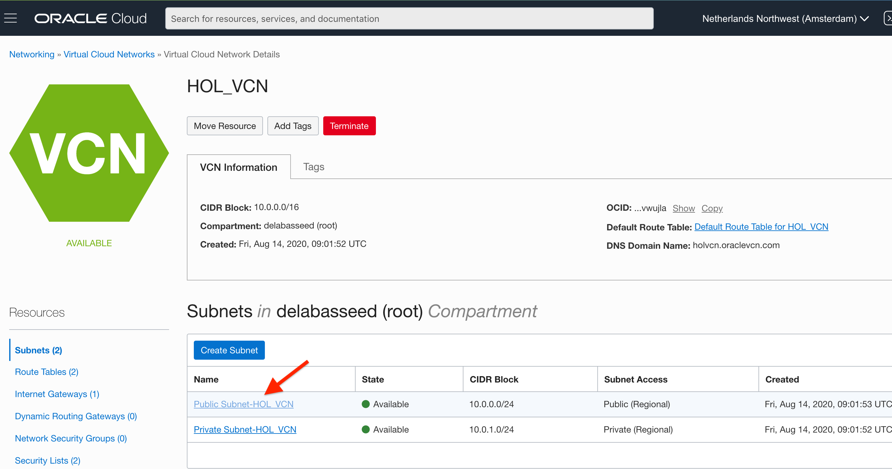

3. Click on the default security list, and click **Add Ingress Rules**.

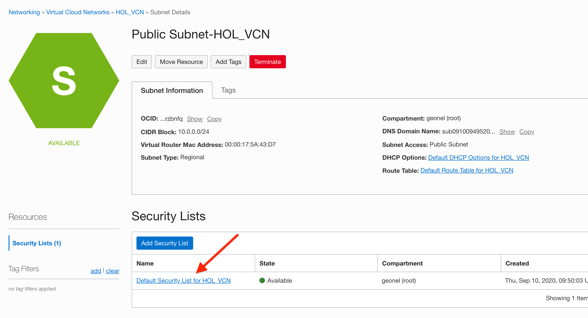
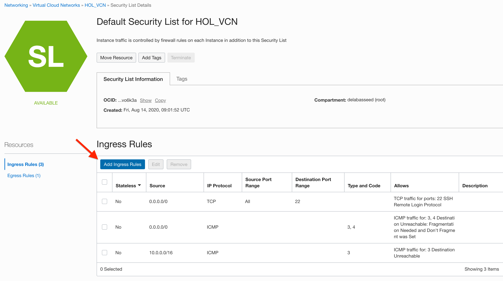

4. Fill in the **Source CIDR** and the **Destination Port Range** as follow, and click **Add Ingress Rules**.

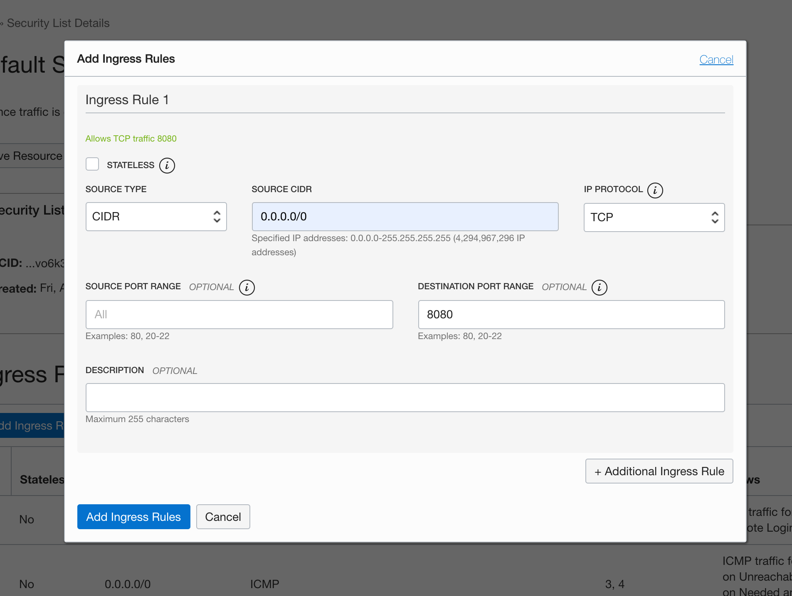

You now have a VNC properly configured. You can move on to the next step.

## Provision a Compute Instance

In this step, you will configure and provision a *Compute Instance* that will be used to test new Java features.

Compute Instances can be physical (bare metal) or virtual, and come in different shapes (memory, CPUs, storage, network, GPUs…). You can also choose between different Operating Systems.

For this lab, you will configure a _VM_ based instance using the _Oracle Linux 7.9_ (OEL) image.

1. From the top-left hamburger menu, select **Core Infrastructure** ➡ **Compute** ➡ **Instances**, and then click **Create Instance**.

💡 If you don't see **Create Instance** button, make sure that your **root** compartment is selected (check left sidebar **List Scope** - 
**COMPARTMENT**).


2. Keep the default OS image, ex. _Oracle Linux 7.9_, at the time of writing.

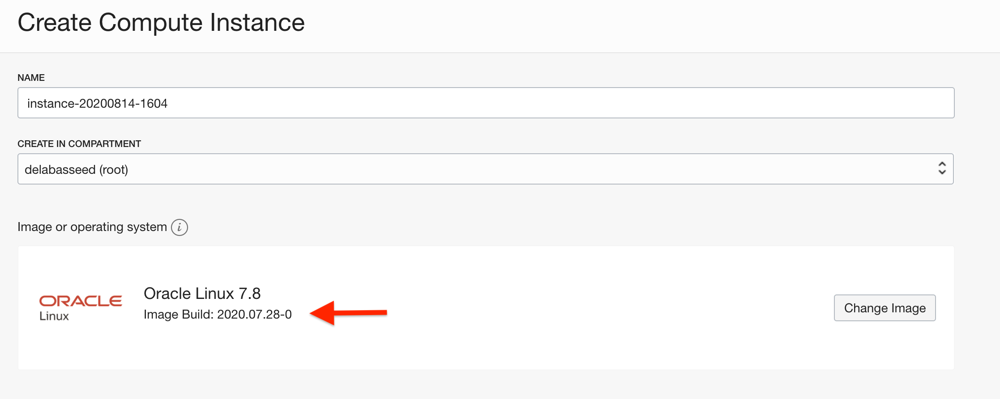


3. Select a Virtual Machine shape by clicking on the **Edit** button of the **'Configure placement and hardware'** box, then click **"Change Shape"**. You can for example select the regular **VM.Standard.E2.1.Micro** shape from the **"Specialty and Legacy"** category.

💡 You will not be able to select a shape that does not fit within the limit of your free account.

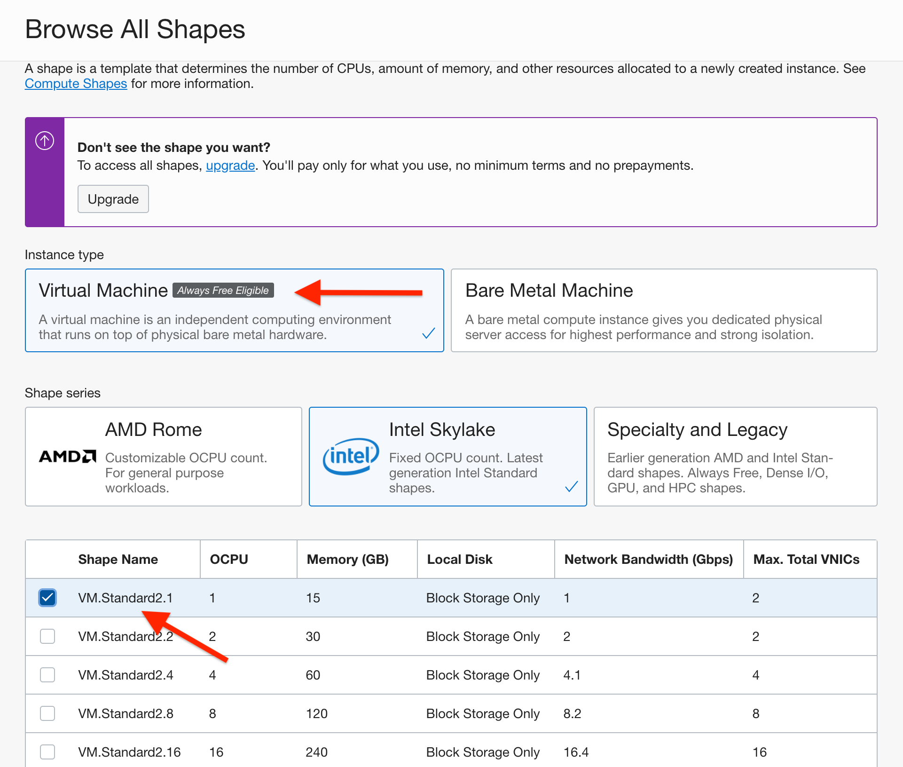


4. Check the network settings. By default, the network should be configured to use your VNC with a public IP address.

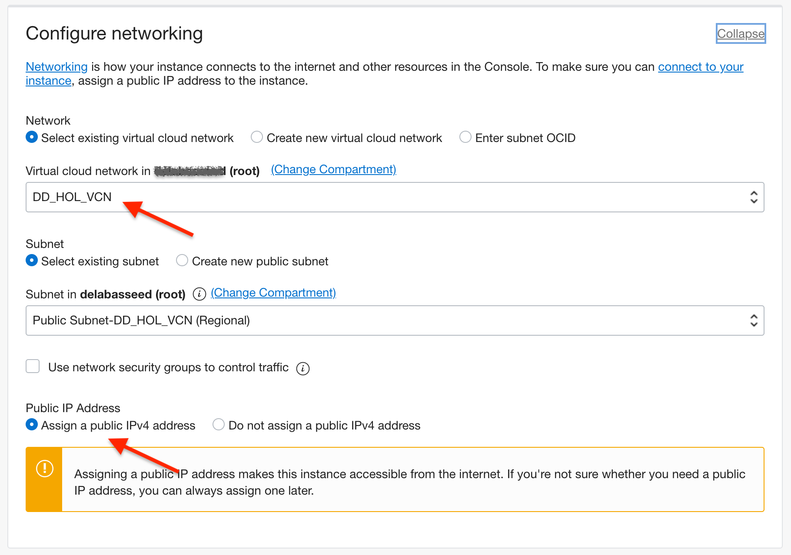


⚠️ OCI will generate the SSH key pair required to authenticate in this new instance.
You must save the generated private key on your machine. Without it, your instance will be useless as you won't be able to log in! The generated public key will be automatically configured in the instance during its provisioning.


5. In the **Add SSH keys** section, select **Generate SSH key pair** and click the **Save Private Key** button. Depending on your browser, the private key will either be downloaded and saved on your machine (ex. in the `~/Downloads` folder) or you might get a prompt asking where it should be saved.

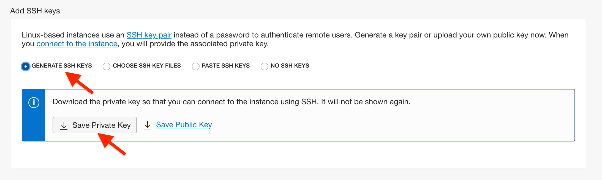 

💡 You can safely ignore the **Configure boot volume** section.

6. You can now click **Create**.

After 50~70 seconds, the big square will switch from the (orange) **PROVISIONING** state to the (green) **RUNNING** state. That means that your instance is up and running!

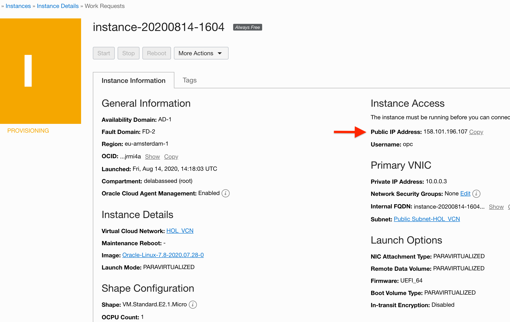 

⚠️ Make sure to write down the **Public IP Address** of your instance as you will need it!

Once your instance is up, you can connect to it! In a shell on your computer, use `ssh` to connect to the instance on OCI: `ssh {username}@{public_ip}`.

💡 If you are on Windows, check [here](https://docs.cloud.oracle.com/en-us/iaas/Content/Compute/Tasks/accessinginstance.htm#linux) how to use OpenSSH. 

💡 Regardless of the OS used, if you have other issues related to `ssh` (ex. you are unable to alter key permissions or only have PuTTY, etc.), you might want to try the [Chrome Secure Shell Extension](https://delabassee.com/ssh-OCI-Chrome/).

The default OEL (Oracle Enterprise Linux) username is **opc**. You also need to specify the path of the private key using the `-i` flag, and the public IP address of your OCI instance.
The final command should look like this:

`ssh -i ~/Downloads/ssh-key-2021-xxx.key -o IdentityAgent=none opc@158.xxx.xxx.xxx`

💡 Some OS (ex. OSX) might refuse to establish the connection, and complain about your private key's permissions being too loose (ex. _"WARNING: UNPROTECTED PRIVATE KEY FILE!"_). If that's the case, make sure to adjust your private key's permissions so that it can't be read by others:

 `chmod 400 ~/Downloads/ssh-key-2021-xxx.key`

You will get a message saying "The authenticity of host '158.xxx.xxx.xxx' can't be established…", you can ignore it by typing **yes**. You are now connected to your OCI instance!

💡 You can ignore the _"LC___CTYPE: cannot change locale…"_ warning, this will be corrected in the next step.


## Configure the instance for Java development


You now have a VM running Linux on OCI. Next, you will install the latest version of OpenJDK and all the tools required for the Lab (Maven, Git, Helidon).

In your instance, run the following command:

```
source <(curl -L https://gist.githubusercontent.com/delabassee/a11e09dcf5a85dae87a5fd6a96ce77ea/raw/83a85722a6015d22c49967b2576405ab18598fa3/vm-setup.sh)
```

The script should take around ~90 seconds. In the meantime, you can check what it is doing by typing the Gist URL (ex. https://gist.githubusercontent.com/delabassee/…) in a browser. In a nutshell, the script: 
* fixes the "LC_CTYPE: cannot change locale…" warning,
* installs various tools (`git`, `tree`, `bat`, …),
* installs the appropriate OpenJDK version,
* installs Apache Maven,
* installs the Helidon CLI,
* configures the VM firewall to open its 8080 port,
* handles some miscellaneous details (ex. setting the path). 

Once the script has been executed, you can test your instance by issuing, for example, `java -version`.

Congratulations, everything is now correctly set-up! You can proceed to the next lab…


