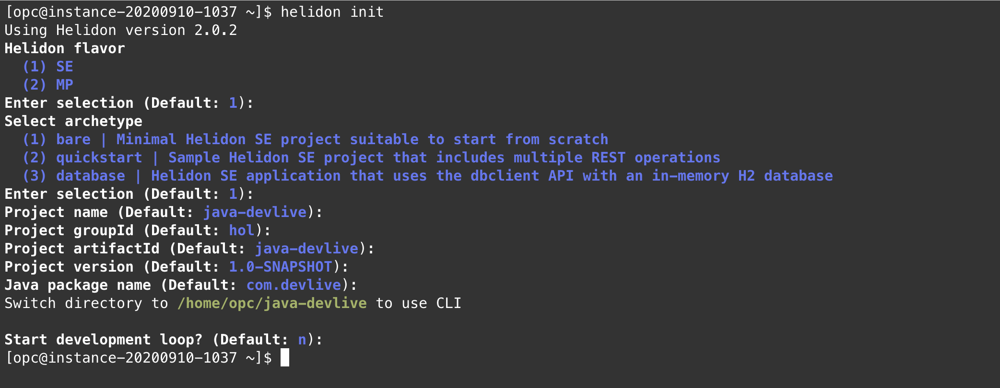
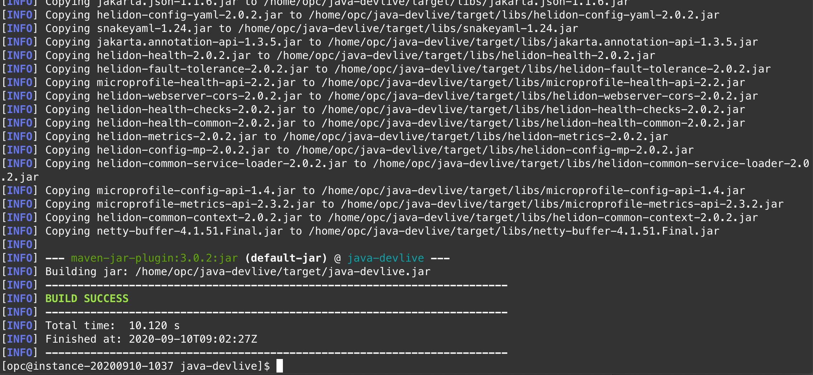

# Lab 3: Exploring Helidon

## Overview

In this 5-minutes lab, you will create a simple Microservices exposing a REST endpoint using Helidon SE. The goal is to have some initial exposure to Helidon, gain some high-level understandings of Helidon and its development workflow.

*Helidon* is an open-source Java-based collection of libraries that one can use to develop lightweight Microservices, it offers 2 programming models:
- Helidon MP: MicroProfile APIs declarative, Java EE/Jakarta EE style (JAX-RS, CDI, etc.).
- Helidon SE: functional style, transparent, no magic (ex. injection).

For more information, please check [https://helidon.io/](https://helidon.io/).

💡 This lab is using Helidon SE as it is simple, lightweight, and fast. Obviously, all the Java features discussed in this HoL can be used with any framework supporting the latest version of Java. Moreover, this lab is only using a small fraction of Helidon's capabilities.
 
## Initialize a Helidon project

One can generate the skeleton of a microservice using Helidon Maven archetypes. To simplify things, you will use the Helidon CLI (Command Line Interface), which under the hood uses the same approach, to initialize a simple Helidon project.

Run `helidon init`, and select the suggested options (**SE flavor**, **bare Minimal Helidon SE project**, and other default values).



If you check the newly generated project (`tree -C myproject`), you will notice it is a Maven project:
* there is `pom.xml`,
* sources are located in `src/main/java/mypackage`,
* tests are located in `src/test/java/mypackage`, etc.


## Build and test an Helidon project

You can build the Helidon project using the `mvn package` command in the `myproject` directory. 



💡 The first time, Maven will populate its local cache so this initial build will take longer!

You can now check the project's target directory (`tree -C target`), it contains a lot of files including the dependencies used by the application, and the application itself.


To run the application, simply use `java -jar target/myartifactid.jar`


The sample service is now accessible on locally port 8080 and given that you have configured earlier the VCN and the instance firewall to allow incoming traffic on port 8080, it should also be accessible via your instance public IP address. 

Invoke the endpoint using either `curl` or a web browser and its public IP address (`http://{public-ip}:8080/greet`), it should return the `{"message":"Hello World!"}` json payload.

💡 You might want to use Firefox during this lab as it formats nicely any returned JSON payload.

## Check the source code

Let's now try to grasp how things work by checking the sources.

#### _Main.java_

`bat src/main/java/mypackage/Main.java`

This is the main class of the application. Amongst other things, its `startServer` method
* creates a Webserver instance,
* invokes the `createRouting` method (see below),
* use the `config` object to configure itself,
* add JSON support.

```java
…
WebServer server = WebServer.builder(createRouting(config))
    .config(config.get("server"))
    .addMediaSupport(JsonpSupport.create())
    .build();
…
```

The `startServer` method also invokes the `createRouting` method which amongst other things
* instantiates `GreetService`,
* adds the `greetService instance as the handler under the "/greet" path,
* builds the updated route object and returns it to the `startServer` method.

```java

GreetService greetService = new GreetService(config);
return Routing.builder()
       …
      .register("/greet", greetService)
      .build();
```


The webserer is then started.
```java
…
server.start();
…
```

#### _GreetService.java_

Let's now look at _src/main/java/mypackage/GreetService.java_, we notice that this class implements the [io.helidon.webserver.Service](https://helidon.io/docs/v2/apidocs/io.helidon.webserver/io/helidon/webserver/Service.html) functional interface which has the `update` method.
```Java
public class GreetService implements Service …
```

The `update` method defines a message handler (`getDefaultMessageHandler`) for the "/" path and the HTTP GET method. Rember that `greetService` has been registered under the "/greet" path, so "/" here is the root path under "/greet" which is equivalent to "/greet".

```java
public void update(Routing.Rules rules) {
   rules.get("/", this::getDefaultMessageHandler);
}
```

The `getDefaultMessageHandler` simply creates a JSON object and  sends it downstream using the `response.send`, that's the result of the REST endpoint.

```java
private void getDefaultMessageHandler(ServerRequest request, ServerResponse response) {
 …
   String msg = String.format("%s %s!", greeting, "World");
   JsonObject returnObject = JSON.createObjectBuilder()
       .add("message", msg)
       .build();
   response.send(returnObject);
}
```

See [here](https://helidon.io/docs/v2/#/se/webserver/01_introduction) for more details but at a very high level, to create REST end-points using Helidon:
* a webserver is configured and instantiated,
* using this webserver, route(s) can be defined,
* each route should have at least one handler that will process the request(s).

## Helidon CLI devloop

You have just used the Helidon CLI to generate the skeleton of an application and used Maven to build it. The application was then executed from the command line using the java launcher.

The Helidon CLI also enables a convenient development loop (aka 'devloop'). In addition to generating the skeleton of an application, the Helidon CLI can also build and run this application, it then also monitors its source files, and restarts the application on every update.

To use the 'devloop' approach, simply go in the project directory and run `helidon dev`.


💡 You can either run the 'devloop' in the background or run it in a separate shell. The latter approach enables you to easily see any potential errors as they happen.

* Open a 2nd SSh connection and run `helidon dev`

* Using the initial SSH connection, slightly change the source code of the application, save it, and see what is happening.

## Wrap-up

This section gave you some basic exposure to Helidon, just enough to use Helidon in the context of the rest of the lab. Do keep in mind that only a small fraction of Helidon's features will be used and that all Java features pesented during this lab apply to all Java-based frameworks/programs.

For more information, please check [https://helidon.io/](https://helidon.io/).