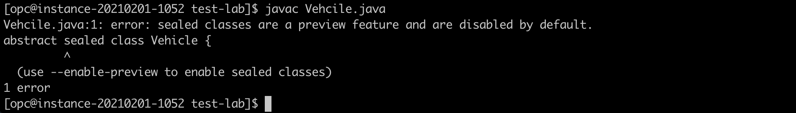

# Lab 4: Java SE Preview Features

## Overview


This  5-minutes lab will give you an introduction to the Java SE *Preview Feature* mechanism.

The Preview Feature mechanism enables to add non-final, fully specified, and implemented features into the Java platform. The goal is to allow developers to use those non-final features, to gather feedback, and to make necessary changes if needed before those features are made final and permanent into the Java platform.

⚠️ *Preview Features* should be confused with *Experimental Features* or with *Incubator Modules*. For details, please check this [article](https://blogs.oracle.com/javamagazine/the-role-of-previews-in-java-14-java-15-java-16-and-beyond). 


## Hello Preview 


1. Create a Sealed class hierarchy

In a new directory, create a simple _Vehcile.java_ abstract class with a nested _Car_ class in it:

`
nano Vehicle.java
`

```java
abstract sealed class Vehicle {

}

final class Car extends Vehicle {

}
```

⚠️ This example uses the Sealed class feature (see Lab 8) to define a basic sealed classes hierarchy, it's sole purpose is to introduce the concept of Preview Feature.

2. Compile it

`javac Vehicle.java`




 This error simply informs you that you are trying to use the Sealed class feature which is a preview feature in Java 16, and that those are disabled by default. To use those, you need to explicitly enable them using the `--enable-preview` java compiler flag. Note that, you also need to confirm to the Java compiler which version of the Preview Feature you are using (ex. using the `--release` flag). 

`javac --enable-preview --release 16 Vehicle.java`

Those 2 flags are enforcing a safeguard mechanism that informs you that non-permanent features are used, and hence those might change in a future Java release.


The compilation now succeeds. Notice that you are still warned that preview features are used in the code.

To run code that uses Preview Feature, you would face the same safeguard as Preview Features are also disabled at runtime! To be used, they should be explicitly enabled using the `--enable-preview` flag. The difference is that at runtime, you don't need to use a flag to confirm that version that you are using.

`java --enable-preview SomePreviewTest`

💡 Running this particular class doesn't make sense as it is empty.

## Preview Features & Helidon

Likewise, to use Preview Feature in Helidon, those should be enabled at both compile-time and runtime.

#### Compile time configuration

In an Helidon project's `pom.xml`, configure the Java compiler plugin to enable Preview Feature. You will have to do this in Lab 5.

```xml
…
<plugins>
   …
   <plugin>
      <groupId>org.apache.maven.plugins</groupId>
      <artifactId>maven-compiler-plugin</artifactId>
      <version>3.8.0</version>
      <configuration>
        <compilerArgs>--enable-preview</compilerArgs>
        <release>15</release>
      </configuration>
   </plugin>
</plugins>
…
```
#### Runtime configuration

To run the application, use the following command:

```
java --enable-preview -jar target/myapp.jar
```

Similarly, to use Preview Features via the Helidon CLI 'devloop', you need to pass the same `--enable-preview` argument to the JVM running the application:

```
helidon dev --app-jvm-args "--enable-preview"
```

## Wrap-up

In this section, you have used Records, a Preview Feature in Java 15. You have also seen how to enable Preview Features in Helidon applications.

In summary, the _Preview Feature_ mechanism:

* allows introducing non-final features into the Java platform (ex. Language Feature)

* allow developers to use those and provide feedback

* enables Oracle to gather that feedback and make changes if needed

* Preview Features are disabled by default, they should explicitly be enabled at both compile-time and runtime

* a given Preview Feature is specific to a given Java version

<br>
Java 15 includes several *Preview Features* which will be discussed in upcoming sections.

* JEP 360: Sealed Classes (Preview)

* JEP 375: Pattern Matching for instanceof (Second Preview)

* JEP 384: Records (Second Preview)
 
