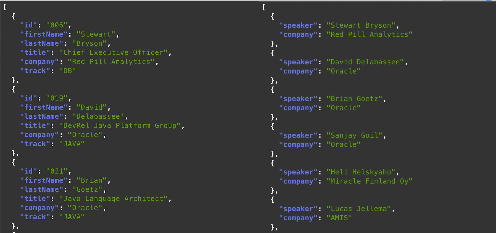

# Lab 7: Records

## Overview

In the lab, you will play *Records*, a Java language feature going through a second preview round in JDK 15.

Records provide a compact syntax for declaring classes which are transparent holders for shallowly immutable data.
A record can be best thought of as a nominal tuple that enable to easily and quickly model immutable "plain data" aggregates.


## A simple Record

💡 Make sure that Preview Features are enabled (see [Lab 4](/?lab=lab-4-java-se-preview-features))!


Similar to enums, Records are technically a special form of classes optimized for certain specific situations.

1. Create a Preson record

Create a file named `Person.java` with the following conntent.

```
public record Person(String lastname, String firstname) {}
```

2. Compile the Person record

Given Records are still in preview, make sure to enable preview feature at compile time.

```
javac --enable-preview --release 15 Person.java
```

3. Decompile the Person record

Using `javap`, you can see what methods are available.

💡 the `-p` parameter instructs `javap` to display the private members of the decompiled class.

```
> javap -p Person
Compiled from "Person.java"
public final class Person extends java.lang.Record {
  private final java.lang.String lastname;
  private final java.lang.String firstname;
  public Person(java.lang.String, java.lang.String);
  public final java.lang.String toString();
  public final int hashCode();
  public final boolean equals(java.lang.Object);
  public java.lang.String lastname();
  public java.lang.String firstname();
}
```
This Record has 

* 2 private final fields (`lastname` and `firstname`), i.e. the Record's components, they are immutable
* a public constructor taking 2 parameters
* 3 'common' methods implementations: `toString()`, `hashCode()` and `equals(java.lang.Object)`
* 2 public accessor methods aptly named `lastname()` and `firstname()` to access the Record's components

You can also observe that the Person record extends the [`java.lang.Record`](https://docs.oracle.com/en/java/javase/14/docs/api/java.base/java/lang/Record.html) abstract class.

To use the Record simply create the a simple `TestRecord.java` class.

```
class TestRecord {

   public static void main(String ...args) {
      var attendee = new Person("Doe", "Jane");
      System.out.println(attendee);
   }
}
```

Compile and run the class.

```
> javac --enable-preview --source 15 TestRecord.java
Note: TestRecord.java uses preview language features.
Note: Recompile with -Xlint:preview for details.

> java --enable-preview TestRecord
Person[lastname=Doe, firstname=Jane]
```

Any of the generated implmentations can be overriden. For example, change the record as follow...

```
public record Person(String lastname, String firstname) {

   @Override
   public String toString() {
      return ("Person{firstname="+firstname+", lastname="+lastname+"}");
   }
}
```

Compile and run the test class.

```
...
> java --enable-preview TestRecord
Person{firstname=Jane, lastname=Doe}
```

## A Speaker Record


The Conference application exposes simple REST endpoints to get speaker related information.

* http://{public-ip-address}:8080/ ➞ Get all speakers 

* http://{public-ip-address}:8080/speakers/company/oracle ➞ Get speakers for a given company

* http://{public-ip-address}:8080/speakers/lastname/delabassee ➞ Get speaker by its lastname

* http://{public-ip-address}:8080/speakers/track/java ➞ Get speakers for a given track

* http://{public-ip-address}:8080/speakers/029 ➞ Get speaker details for a given id


Browse the source code to understand how things work.


* `Main.java` defines the routings, including the "/speakers" path and its `speakerService` handler class.

* `SpeakerService.java` defines the various handlers under the "/speakers" path.

The `Speaker.java` class is interesting as it models the Speaker type with all its details (lastname, firstname, etc.), i.e. it is data aggregate that represent a speaker. Once created a speaker is effectively immutable as the class is `final', moreover there is no way to change the fields (ex. private fields, no setters).

Migrating this regular class into a Record is straightforward. Just replace the `Record.java` class content with the definition of the Speaker record. That definition should include the various components related to a speaker. 

```
public record Speaker (String id,
                       String firstName,
                       String lastName,
                       String title,
                       String company,
                       Track track) {}
```

💡 The Java compiler will automatically generate a default constructor implementation. If needed, this constructor can be customized. In addition, a `toString`, an `equals` and an `hashCode` default implementations will be generated. If required, those implementations can be overridden. Finally, the Java compiler will also generate accessor methods for each component of the Record.

If you now compile the application, you will get mutliple errors. Can you guess why?

```
…src/main/java/conference/SpeakerRepository.java:[52,69] cannot find symbol
   symbol:   method getLastName()
   location: variable e of type conference.Speaker
…src/main/java/conference/SpeakerRepository.java:[62,77] cannot find symbol
   symbol:   method getTrack()
   location: variable e of type conference.Speaker
…
```

Those errors make sense as the (old) `Speaker.java` class was using the Javabean getter convention to provide access its priavte field.
Records on the other hand rely on (automatically generated) accessor methods to enable access to its various components. So that needs to be fixed in the conference application code! Go through the `SpeakerRepositotory.java` class and make sure to use accessor methods for accessing components instead of getters. This needs to be fixed code accessing any components of the Speaker record (lastName, company, etc.).

For example, change 
```
public List<Speaker> getAll() {
   List<Speaker> allSpeakers = speakers.stream()
       .sorted(Comparator.comparing(Speaker::getLastName)) // getter
       .collect(Collectors.toList());
   return allSpeakers;
}
```
to
```
public List<Speaker> getAll() {
   List<Speaker> allSpeakers = speakers.stream()
       .sorted(Comparator.comparing(Speaker::lastName)) // accessor method
       .collect(Collectors.toList());
   return allSpeakers;
}
```
The application will now compile fine but if you test it, you will not get any result!

The (old) `Speaker.java` class was relying on Helidon JSONB support. The issue you are facing is that Record is a fairly recent feature, and not all JSONB frameworks support them. The good news is that things are changing rapidly, ex. Apache Johnson and Jackson will soon offer full Record support.

In the meantime, we can easily fix this by updating the Speaker record to return, using the JSONP API, a JSON representation of its various components.


1. Add the following `toJson` method to the `Speaker.java` record.

```
JsonObject toJson() {
   JsonObject payload = Json.createObjectBuilder()
      .add("id", id)
      .add("firstName", firstName)
      .add("lastName", lastName)
      .add("title", title)
      .add("company", company)
      .add("track", track.toString())
      .build();
   return payload;
}
```

💡 Make sure to update the imports accordingly

```
import javax.json.Json;
import javax.json.JsonObject;
```

2. Update the code to return a List of `JsonObject` instead of List of `Speaker`.	

For example, update update the `getAll` method in the the `SpeakerService.java` class 

```
List<Speaker> allSpeakers = this.speakers.getAll();
if (allSpeakers.size() > 0)
   response.send(allSpeakers);
else sendError(response, 400, "getAll - no speaker found!?");
```
to use the Streams API and the newly added `toJson` method to return List of `JsonObject` as follow. 
```
List<Speaker> allSpeakers = this.speakers.getAll();
if (allSpeakers.size() > 0) {
      response.send(allSpeakers.stream()
                .map(Speaker::toJson)
                .collect(Collectors.toList()));
} else Util.sendError(response, 400, "getAll - no speaker found!?");
```

If you build and test the application, it should behave like before.

We can observe that using Records leads to a more concise, more readable code when it comes to model data aggregates! Shortly, when JSONB frameworks will support Records, the marshaling/unmarshaling between JSON payload and Records will be transparent. That will again simplify things as we won't have to use the JSONP API to add to the Record, a method to return its JSON representation!

📝 Make sure to add support Records to all `SpeakerService.java` methods (`getByCompany`, `getByTrack`, `getSpeakersById`) as you just did for the `getAll` method.


## Local Records


When you are developing applications, think how many times you are creating intermediate values that are a simple group of variables? That should be very frequent! The Record feature is perfect to cope with such use-case..

Local Record is a feature introduced in the second Record preview in JDK 15. Local Records offer a convenient option to declare a record inside a method, close to the code which manipulates the variables.

For this exercise, let's pretend that we want to return a simpler form of Speaker, ex. just the last name/first name pair and the company.

1. Update the `getAll` method to include a local Record, i.e. within the body of the method!

```
record SpeakerSummary(String last, String first, String company) {}
```

2. Add it a `toJson` method JSONP 

```
record SpeakerSummary(String last, String first, String company) {
   JsonObject toJson() {
      JsonObject payload = Json.createObjectBuilder()
            .add("speaker", first() + " " + last())
            .add("company", company())
            .build();
      return payload;
   }
}
```

3. Adapt the the`getAll` method to create, using the Streams API, a list of SpeakerSummary instead of a list of Speaker. 


```
List<Speaker> allSpeakers = this.speakers.getAll();
if (allSpeakers.size() > 0) {
   response.send(allSpeakers.stream()
              .map(s -> new SpeakerSummary(s.lastName(), s.firstName(), s.company()).toJson())
              .collect(Collectors.toList()));
} else sendError(response, 400, "getAll - no speaker found!?");
```

If you now test the endpoint, you will get the shorter speaker representation (see right colunmn below).




📝 Make sure to update all `SpeakerService.java` methods for the new `SpeakerSummary` record. As an additional exercice, try to create differents Records.


## Wrap-up

In this exercice, you have used Records.

Records allow to easily and quickly create immutable data aggregates. Records are currently in a preview feature in JDK 15 (second preview round) and are slated to be made final and permanent in Java 16, in March 2021.

For more details on Records, please check the following resources.

* [JEP 384: Records (2nd Preview)](https://openjdk.java.net/jeps/384)
* [Java Feature Spotlight: Records](https://inside.java/2020/02/04/spotlightrecords/)


